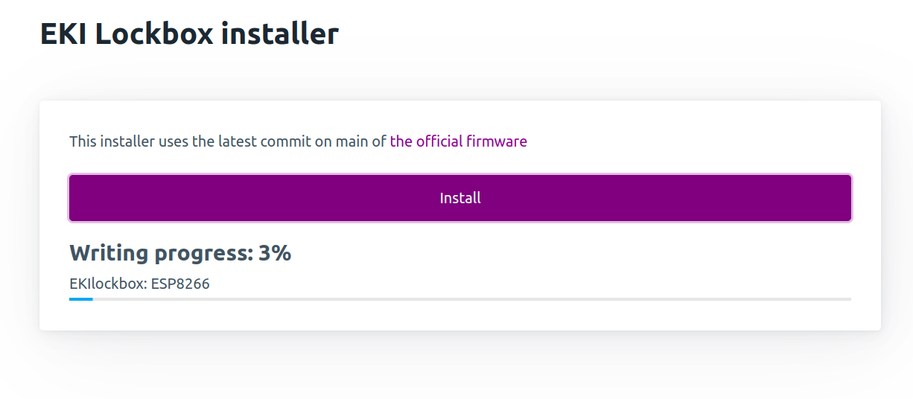
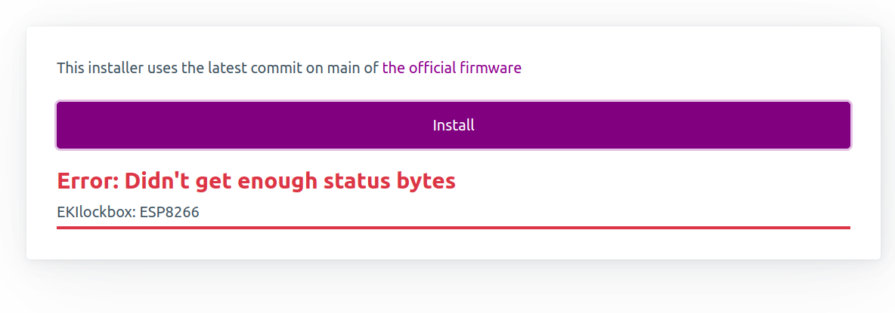
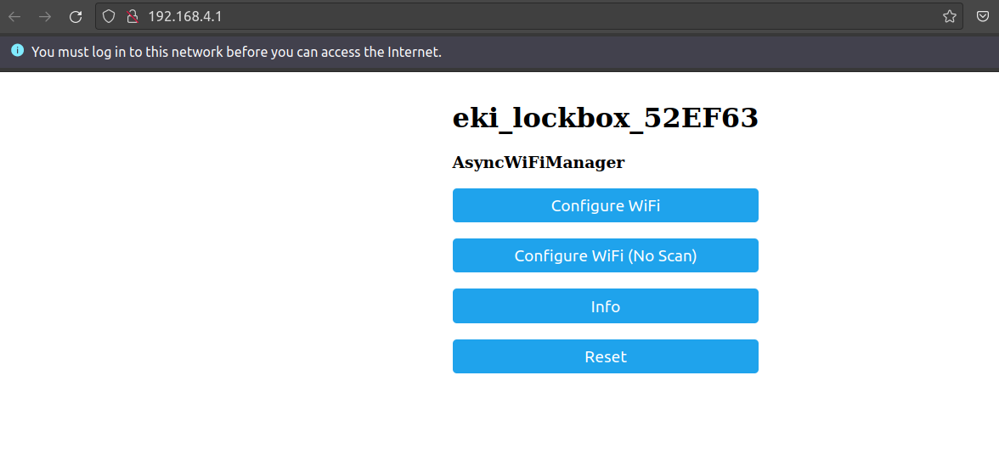
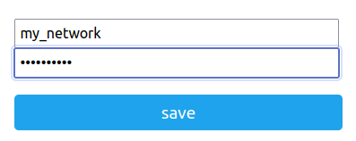
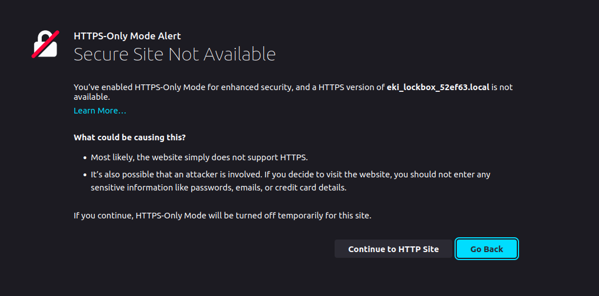
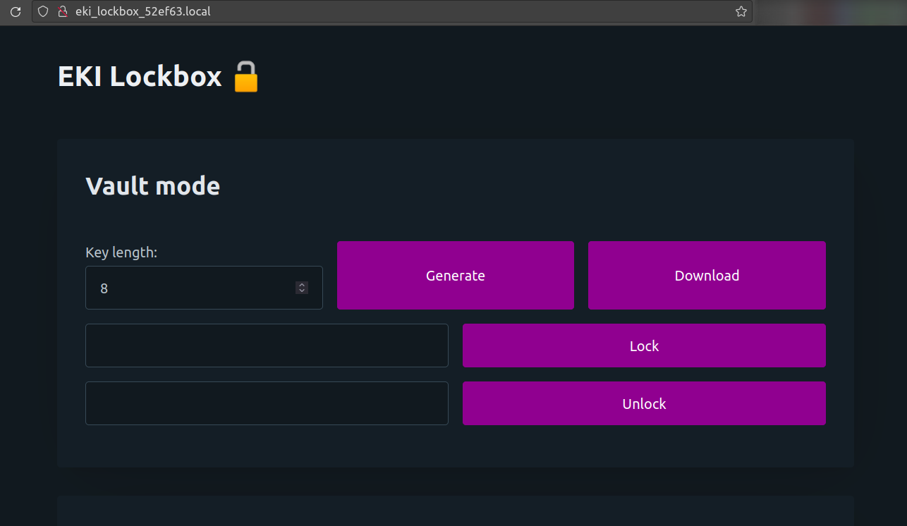
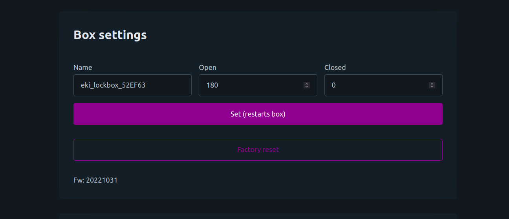

## Setting up

- Print, or have someone print the box and lid.
- Aquire a 9 gram SG90 servo and a NodeMCU Amica (a Lolin does not (yet!) fit the current box design).
- Cut one of the horns of the servo to length. In the locked position it should stick out a little through its slot so it goes inside the lid when locked.
- Flash the MCU. Install Platformio and clone or download the repository or use the new web installer: <https://embeddedkink.com/lockbox-firmware/>

The following error is expected:

- Power up the box with a high quality USB charger.
- Using a phone, laptop or other device, connect to the wifi network and navigate to the captive portal.

- Enter your wifi credentials on the webpage and remember the name of the box.

- If you entered the correct SSID and PSK, you can now connect back to your own wifi network. The box can be found using mDNS. Navigate for example to <http://eki_lockbox_abcd12.local>.

An HTTPS warning is normal.

- Power down the box.
- Connect the servo to the MCU. Brown to GND, red to 3v3, orange to D4.
- Pull the power wires through the hole in the bottom of the box and connect 5v (red) to Vin and ground (black) to GND.
- With everything outside of the box, do a test run.
  - Make sure the horn is in a neutral position.
  - Lock the box.
  - Verify that the horn is now in the correct rotation to pass through its slit in the box.
  - Open the box with the password in the newly created txt file.
- If there are no issues, the assembly can be pushed into the box in a gentle manner. Make sure the side of the MCU with the power wires is on the side of the box with the hole.

Not all 9g servos are the same. If the horn moves too little or too much (only about 90 degrees is necessary) then the open- and closed position can be adjusted. This can of course only be done when the box is not locked to prevent cheating.

