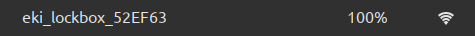

# Assembly guide

## Hardware

- Print, or have someone print the box and lid. On older versions a cam must be printed as well.
- Acquire a 9 gram SG90 servo and a NodeMCU Amica (a Lolin does not fit the current box design).
- Acquire a USB to dupont adapter for power.
- Cut one of the horns of the servo to length. In the locked position it should stick out a little through its slot so it goes inside the lid when locked.
- Flash the MCU. Install Platformio and download the repository or use the new web installer: <https://embeddedkink.com/lockbox-firmware/>

The following error is expected:

## Connecting the box

- Power up the box with a high quality USB charger.
- Using a phone, laptop or other device, connect to the wifi network and navigate to the captive portal.

- Enter your wifi credentials on the webpage and remember the name of the box.

- If you entered the correct SSID and PSK, you can now connect back to your own wifi network. The box can be found using mDNS. Navigate for example to <http://eki_lockbox_abcd12.local>.

An HTTPS warning is normal.

## Assembly

- Power down the box.
- Connect the servo to the MCU. Brown to GND, red to 3v3, orange to D4.
- Pull the power wires through the hole in the bottom of the box and connect 5v (red) to Vin and ground (black) to GND.
- With everything outside of the box, do a test run.
  - Make sure the horn is in a neutral position.
  - Lock the box.
  - Verify that the horn is now in the correct rotation to pass through its slit in the box.
  - Unlock the box with the same password.
- If there are no issues, the assembly can be pushed into the box in a gentle manner. Make sure the side of the MCU with the power wires is on the side of the box with the hole.

Not all 9g servos are the same. If the horn moves too little or too much (only about 90 degrees is necessary) then the open- and closed position can be adjusted. This can of course only be done when the box is not locked to prevent cheating.

## Help, I cannot connect

If the WiFi network of the box is still online then the box failed to connect to your WiFi network. You may have entered the wrong credentials. Try again the same way you did the first time.

If the box is connected to your WiFi network but you cannot find its webpage then you can try the following.

- if you changed the name of the box you can now find it at `http://<name>.local` so if the new name is myfirstbox it becomes <http://myfirstbox.local>
- if you forgot the name or URL you can find it in different ways
  - Go to your routers webpage and see if there's a device on the network that starts with "ESP-". Enter the matching IP address in your browser.
  - In a terminal, use `dns-sd -B _ekilb._tcp .` or `avahi-browse -a`
