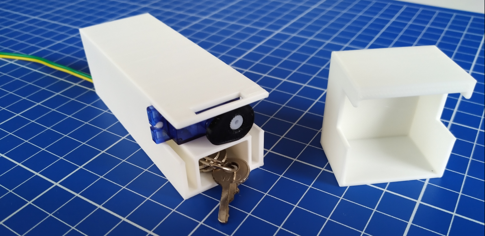
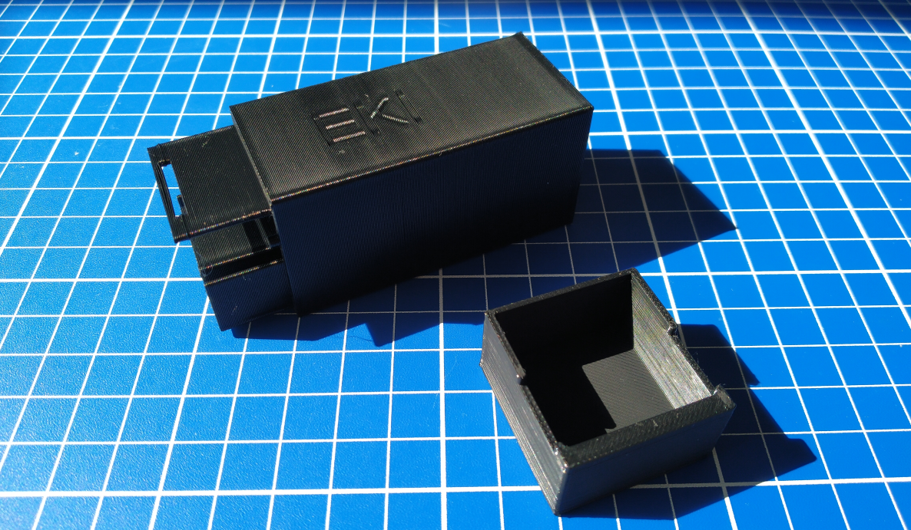

# Lockbox

[back](./)

GitHub repositories:

- [Enclosure](https://github.com/embeddedkink/lockbox-enclosure)
- [Assembly guide](./lockbox-assembly-guide.md)
- [Firmware](https://github.com/embeddedkink/lockbox-firmware)
- [Firmware installer](https://embeddedkink.com/lockbox-firmware/)

## About

This project aims to create a secure lockbox that can be connected to online keyholding services with minimal effort. With a companion app on a desktop, locking up is as easy as running one single command, and uploading the resulting .txt or .png file.
Usage of the box is fully private and neither the box nor the controlling software pings out to remote servers. Privacy is a right we take very seriously.

The project has been designed to be as easy to set up as possible. Off the shelf components like the NodeMCU Amica and an SG90 servo have been chosen for their wide availability. The enclosure is 3d printed.

The security of the box does not rely on tough steel or unbreakable titanium. Instead, the box is designed to break away under force in case of an emergency, but it does so in a way that is destructive to the box. This provices a financial incentive not to do so unnecessarily and is tamper evident.

## Selling points

- Secure. No way to break into the box without physically destroying it
- Safe. Is the emergency bigger than the cost of replacing the box? Just force the lid off. (This does destroy the box!)
- Cheap. Only one actuator and no real time clock necessary
- Compatible with all locks based on small physical keys (larger key compatibility coming soon!)
- Fully local and private. No dependency on the cloud and no telemetry is collected

## Usage

Connect power to the microcontroller. Put the key into the empty partition of the lockbox. Put the lid onto the box. Lock the box, send the password away to your platform of choice (Emlalock is known to accept `.txt` files), and delete it permanently on you local machine. The box can now be safely turned off. It only needs to be turned on again when you have the password and are ready to unlock.

If you had to abort a session, the electronics can be reset and used in a new box. This can be done by pressing the "flash" button on the nodemcu after it has booted up.

## Important technical details

### A note on updates

The box can be updated manually but will not be seeking for the latest updates automatically. Updating the box is not hard, but requires some technical steps. Updates can be done manually using Platformio (or Arduino IDE but that's not officially supported) or using the web flasher.

### Power

The box has been measured to draw 0.4 amps at 5 volts with the servo stalled. This should be handled by most modern USB devices. Do note that its behaviour is not guaranteed to be in spec so **the use of a quality USB power supply is highly recommended**.
Note that some servos may not perform identically to ours, even if they're marketed as 9g SG90.

The box allows dupont cables to come out of the bottom. You can power it with a female USB micro-b to dupont breakout board along with 2 dupont female to female wires; solder your own USB to dupont cable; or even 3d print a USB to dupont adapter.

### Compatibility

Early versions of the box were controlled with a TCP connection. This is no longer recommended. Use the latest version of the MCU firmware. This now comes with an easy to use web UI. The C# and Python control software still work but are not recommended.
Boxes and lids come with their commit hash on the top and bottom. eae25c is a good minimal box but relies on a specially printed locking cam. Later boxes like acaa41 use a horn that comes with the servo that has then be cut to length. Boxes and lids of the same commit hash are guaranteed to be compatible. Some other boxes and lids may be compatible with each other as well, but this is not documented.
